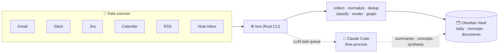
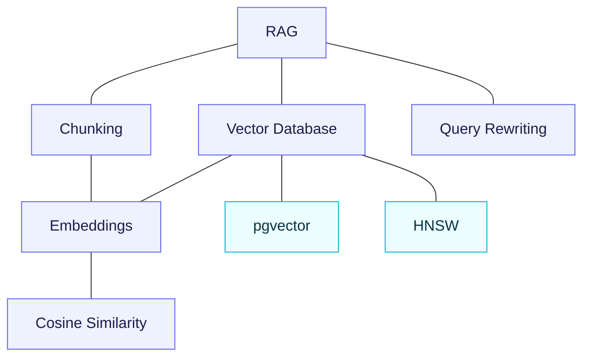
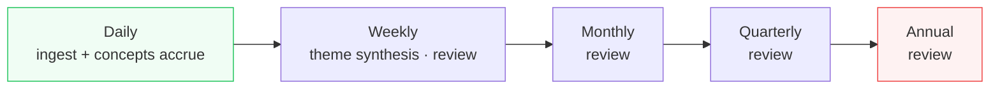

# Lorekeeper

[](https://www.rust-lang.org)
[](LICENSE)
[](https://deepwiki.com/junyeong-ai/lorekeeper)

> **English** | **[한국어](README.md)**

**Turn your scattered daily work into a knowledge wiki that grows itself.**
Lorekeeper collects from Gmail, Slack, Jira, Calendar, RSS, and dropped notes every day, deduplicates them, extracts concepts, and writes structured Obsidian markdown. The LLM does the *bookkeeping*, so your knowledge **compounds** instead of rotting.

---

## Why Lorekeeper?

Notes and wikis fail not because reading or thinking is hard, but because of the **bookkeeping** — updating cross-references, deduping, classifying, flagging contradictions. People can't keep up, so the wiki gets abandoned. Lorekeeper hands that bookkeeping to an LLM.

> 📖 **New to the terms?** — **vault**: a folder of markdown files (i.e. your knowledge store) · **concept**: one page per topic · **wikilink**: a `[[another page]]` link between pages · **bookkeeping**: the chore of updating links, dedup, and categories by hand.

| | |
|---|---|
| 📥 **Configure once → runs daily** | Collects yesterday's activity and knowledge from email, chat, issues, calendar, feeds, and notes |
| 🧹 **Cuts the noise** | Dedup, filters irrelevant items, splits *your* work into a work-log automatically |
| 🧩 **Concepts as assets** | The same concept converges to one page (`Vector DB` = `vector-database`), categorized and related |
| 🔗 **A connected knowledge graph** | Wikilinks, backlinks, and clusters link concepts to one another |
| 📈 **Compounding** | Weekly / monthly / quarterly / annual synthesis — value grows over time |
| 🔑 **No API key** | Claude Code's own session does the LLM work (no separate billing) |

> 💡 Inspired by Andrej Karpathy's *"LLM-maintained wiki"*: **raw sources stay immutable**, **the LLM writes and maintains the wiki**, and **the schema (config) defines the workflow**. You curate sources and ask questions; the LLM does the bookkeeping.

---

## At a glance



`lore` (the deterministic Rust binary) builds the structure; `/lore-process` (a Claude Code skill) fills the parts that need *judgment* — summaries, concepts. It uses Claude Code's LLM session directly, with no API key.

---

## Quick start (5 minutes)

> **Before you start, you'll need** — nothing exotic:
> - 💻 **macOS or Linux** (Windows ships a PowerShell installer)
> - 🤖 **Claude Code** — `/lore-process` fills in summaries & concepts (no separate API key or billing)
> - 🔑 **Credentials only for the sources you enable** — e.g. Google sign-in for Gmail/Drive/Calendar, a token for Slack
> - 🗂️ **(optional) Obsidian** — for pretty graph browsing. Without it, the output is still plain markdown
>
> 💡 **Want to try it key-free first?** Enable just `rss` and the note `inbox/` — neither needs auth, so it runs immediately.

```bash
# 1) Install — binary + templates + Claude Code skills in one go
curl -fsSL https://raw.githubusercontent.com/junyeong-ai/lorekeeper/main/scripts/install.sh | bash

# 2) Configure — copy the example and edit for your environment
cp ~/.config/lorekeeper/config.example.yaml ~/.config/lorekeeper/config.yaml
$EDITOR ~/.config/lorekeeper/config.yaml
#    (Not sure what IDs to fill in? Run `/lore-setup` in Claude Code — it finds your
#     Slack channel / Jira project / calendar IDs for you.)

# 3) Credentials — interactive wizard (Google tokens minted in your browser)
lore init credentials

# 4) Validate — checks config only, no network
lore validate

# 5) Ingest → fill
lore ingest                       # collect sources, write structural pages, queue LLM tasks
#    then, in Claude Code:        /lore-process     ← fills summaries & concepts

# 6) On autopilot
lore schedule | crontab -         # project the config's cron into crontab
```

> You don't need Obsidian — the output is plain markdown + folders, readable as text. Obsidian just makes the graph nicer to browse.

---

## What do you actually get?

Let's walk through a hypothetical. **Sumin**, an AI engineer, drops a RAG troubleshooting note into the vault's `inbox/`.

> The page examples below show **key fields only** — real files also carry housekeeping frontmatter such as `updated`.

### 📝 Input — `inbox/rag-retrieval-quality.md`

```markdown
# RAG pipeline: fixing low-recall retrieval

Problem: ~30% of queries retrieved irrelevant chunks, so the generator hallucinated.
Cause: (1) 2000-token chunks were too coarse — a chunk's embedding averaged several
       topics. (2) We embedded the raw conversational question.
Fix: re-chunk to ~400 tokens, rewrite the question into a standalone query, switch
     similarity L2 → cosine. Recall@5: 0.62 → 0.91.
```

### ▶️ Run

```console
$ lore ingest
▸ notes (manual)
  extracted: 1 items
  ✓ wrote: wiki/documents/rag-pipeline-fixing-low-recall-retrieval.md (document)

Done. 1 pages written, 0 personal items tracked.
```

The page exists, but its `## Summary` / `## Related Concepts` are still empty — `lore ingest` queued the LLM work:

```console
$ lore queue status
  [current] sum-… (summarize)        → wiki/documents/rag-pipeline-…
  [current] ext-… (extract-concepts) → wiki/documents/rag-pipeline-…
queue: 2 current, 0 stale, 0 missing-target across 2 task(s)
```

Now, in a Claude Code session, run **`/lore-process`**. The skill drains that queue — writing each summary and extracting concepts — using Claude's own LLM (no API key). When it finishes, `lore queue status` reports `0 current` and the page is filled:

### ✅ Result ① — the document page (summary + concept links filled in)

```markdown
---
id: rag-pipeline-fixing-low-recall-retrieval
title: "RAG pipeline: fixing low-recall retrieval"
created: 2026-06-13
tags: ["document"]
---

## Summary
Re-chunking from 2000→400 tokens, rewriting conversational questions into standalone
queries, and switching similarity from L2 to cosine lifted Recall@5 from 0.62 → 0.91.
The load-bearing lesson: retrieval quality is dominated by **chunk granularity and
query formulation**, not by the choice of embedding model.

## Content
… (normalized, preserved from the original) …

## Related Concepts
- [[Retrieval-Augmented Generation]]
- [[Vector Database]]
- [[Chunking]]
- [[Query Rewriting]]
```

### ✅ Result ② — concept pages **converge** (the key payoff)

Days later Sumin drops another note, *"Choosing a vector database for production."* "Vector database" appears in both notes — but instead of forking a new page, it **joins the existing concept**:

```markdown
---
id: vector-database
title: "Vector Database"
aliases: ["Vector Database", "Vector DB"]
category: ai-ml
source_count: 2          # ← two documents cite this one concept
---

## Synthesis
A vector database stores high-dimensional embeddings and serves approximate
nearest-neighbor (ANN) search over them. The choice is often driven less by query
latency than by **operational simplicity** — co-locating vectors with relational data
(e.g. pgvector on Postgres) avoids running a separate stateful system.

## Sources
- [[choosing-a-vector-database-for-production]]
- [[rag-pipeline-fixing-low-recall-retrieval]]
```

> Whether you write `Vector DB` or `Vector Database`, it lands on **one page** (registered as an alias). Knowledge not fragmenting — that *is* the "compounds over time" promise.

### ✅ Result ③ — a by-topic index (`wiki/index.md`)

```markdown
# Wiki Index

## Concepts (16)

### ai-ml (6)
- [[vector-database|Vector Database]] — stores high-dimensional embeddings and serves ANN search; selection is driven by operational simplicity more than query latency…
- [[retrieval-augmented-generation|RAG]] — grounds an LM's output in retrieved passages; answer quality is dominated by the retrieval stage, not the embedding model…
- [[chunking|Chunking]] — splitting documents into embed/retrieve units; granularity strongly governs retrieval quality…

### infrastructure (10)
- [[kubernetes|Kubernetes]] — container orchestration; reliable operation depends on observing pod memory and restart signals…
```

### ✅ Result ④ — a knowledge graph forms

`lore graph suggest-links` / `cluster` discover relationships between concepts (ranked by an Adamic-Adar score that down-weights hub co-citations):



### 📈 Over time — compounding



Each day's ingest grows the concept graph; synthesis summarizes it at ever-higher altitudes. Daily → weekly → quarterly → annual each build **on top of** what's already there, never re-deriving it.

---

## Sources

| Type | Use for | Auth |
|---|---|---|
| `gmail` | Email digest (filter by label / sender) | Google OAuth |
| `slack-channel` | Whole channel = team activity (threads, bot filter, watch_users) | Slack token |
| `slack-search` | Keyword-trend search | Slack user token |
| `jira` | Issues you worked on that day (ADF→Markdown) | Jira API |
| `google-calendar` | Schedule + meeting notes (auto-extracted from Drive links) | Google OAuth |
| `google-drive` | Curated docs in a Drive folder | Google OAuth |
| `rss` | Vendor blogs / news → concepts (no auth, multi-feed) | none |
| `manual` | Markdown, text, and HTML files dropped in `inbox/` | none |

The source key becomes the vault subfolder name. You can define several of the same type (e.g. `team-slack`, `ai-news`). Full reference: [`config.example.yaml`](config.example.yaml).

---

## Core ideas

- **Output is plain markdown** — `daily/{source}/` (raw timeline), `wiki/concepts/` (concepts), `wiki/documents/` (documents), `me/` (work-log & reviews), `synthesis/` (weekly themes).
- **Materialized views** — a page has two layers. The **structural layer** (frontmatter, raw items, headings) re-renders every ingest; the **semantic layer** (summary, concepts, synthesis) is LLM-owned and preserved across re-renders. Unchanged input enqueues zero LLM work (a BLAKE3 hash decides).
- **No data loss** — re-runs are idempotent (byte-identical). Streaming sources (RSS) keep a permanent event log, so scrolled-out items are never lost.
- **Realized-only** — a future date materializes no page (a forecast isn't knowledge yet). It becomes knowledge once the date arrives.
- **The graph does the bookkeeping** — `backlinks-sync` (re-derive citation counts), `lint` (orphans, broken links, near-dupes), `merge` (fold duplicate concepts), `cluster` / `suggest-links` (discover relationships).

---

## Commands

```bash
lore validate                 # check config (no network)
lore ingest [source]          # ingest (all sources, or a single one)
lore ingest --dry-run         # preview without writing to the vault
lore ingest --date 2026-06-01 # re-materialize a specific day (backfill / repair)
lore synthesis weekly         # weekly synthesis + personal review (monthly/quarterly/annual too)
lore schedule | crontab -     # emit cron lines
lore wiki concepts            # list concepts
lore wiki index / log / map   # rebuild by-topic index / by-time timeline / citation-cluster map
lore graph lint               # structural health (orphans, broken links, near-dupes, …)
lore graph suggest-links      # concept-relationship candidates (Adamic-Adar)
lore graph cluster            # topic communities (Louvain)
lore graph backlinks-sync     # re-derive each concept's ## Sources + citation count
lore graph merge <from> <into># fold a duplicate concept into the canonical one
lore doctor                   # vault text-cleanliness audit
lore queue status / prune     # LLM task queue status / clear dead tasks
lore schema                   # generate wiki/AGENTS.md (the page-format schema)
```

---

## Claude Code skills

Skills that pair with the deterministic `lore` binary — the *judgment* parts run on Claude Code's LLM.

| Skill | What it does |
|---|---|
| `/lore-process` | Drains the LLM queue after ingest — fills summaries, concepts, themes, reviews |
| `/lore-setup` | Builds your config by inspecting your workspace — discovers Slack channel / Jira project / calendar IDs |
| `/lore-wiki` | Semantic query (with compounding) · add sources · structural + semantic audit |
| `/lore-capture` | Capture an insight from active work straight into the vault |
| `/lore-extract` | Batch-extract transferable knowledge from a project repo (scan→run→audit) |
| `/lore-ingest` | Wraps the `lore` CLI (ingest, synthesis, status, schedule) |

> e.g. `/lore-wiki query "how do I improve RAG retrieval quality?"` → answers by cross-citing the vault's concepts, and files a good answer back as a page under `wiki/explorations/`.

---

## LLM provider modes

`llm.provider` in `config.yaml`:

| Mode | Default | Description |
|---|:---:|---|
| `queue` | ✓ | Queues JSONL tasks under `<vault>/.lorekeeper/queue/`; `/lore-process` drains them with Claude Code's session — **no API key, no separate billing** |
| `noop` | | No LLM work — for development, CI, or template-only runs |

Unattended cron: `lore ingest; claude -p "/lore-process"` (`;` not `&&`, so a partial source failure still lets the healthy sources' tasks drain).

---

## Install · build

```bash
# One-line install (macOS / Linux) — binary, templates, skills, SHA256-verified
curl -fsSL https://raw.githubusercontent.com/junyeong-ai/lorekeeper/main/scripts/install.sh | bash

# Windows (PowerShell)
irm https://raw.githubusercontent.com/junyeong-ai/lorekeeper/main/scripts/install.ps1 | iex

# Build from source
cargo build --release && ./target/release/lore --help
```

Install flags: `--version`, `--install-dir`, `--data-dir`, `--skill {user,project,none}`, `--from-source`, `--force`, `--yes`, `--dry-run` (`--help` lists them all). Uninstall: `./scripts/uninstall.sh`.

---

## Credentials

Environment variables or `<vault>/.lorekeeper/credentials.json` (0600). Env vars take precedence over the file.

```bash
lore init credentials   # interactive wizard — Google tokens minted via browser OAuth
```

- **Google**: `LORE_GOOGLE_CLIENT_ID/SECRET/REFRESH_TOKEN` — Gmail/Drive/Calendar **read-only** scopes. Needs a "Desktop app" OAuth client.
- **Slack**: `LORE_SLACK_TOKEN` (bot `xoxb-`) or `LORE_SLACK_USER_TOKEN` (`xoxp-`). `slack-search` requires the user token.
- **Jira**: `LORE_JIRA_URL / EMAIL / TOKEN`.

> Credentials live only in `credentials.json` (gitignored) — they are never committed to the repo.

---

## Scheduling

```bash
lore schedule | crontab -
```

`ingest.schedule` emits a single `lore ingest` line that runs **every source in one process** (the work-log is a cross-source daily aggregate, so per-source runs would overwrite it partially). Each synthesis period (weekly/monthly/quarterly/annual) emits its own cron line, and `maintenance.schedule` automates the janitors.

For unattended operation the installer also ships two Claude scheduled-task definitions (`lore-daily-ingest`, `lore-weekly-ingest`) — daily ingest + queue drain + graph reconcile, and weekly synthesis + knowledge audit.

---

## Learn more

- **Full config reference** — [`config.example.yaml`](config.example.yaml) (every source and option, commented)
- **Page-format schema** — `lore schema` generates `wiki/AGENTS.md` in your vault
- **Architecture deep-dive** — [DeepWiki](https://deepwiki.com/junyeong-ai/lorekeeper)

## Built with

Rust 1.96 · 2024 edition. `tokio`/`reqwest` (async sources), `jiff` (timezone-correct dates), `minijinja` (templates), `petgraph` (wikilink graph), `blake3` (event/cache hashing). License: MIT.
