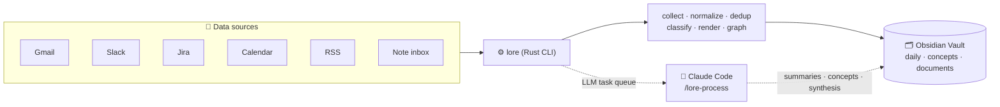
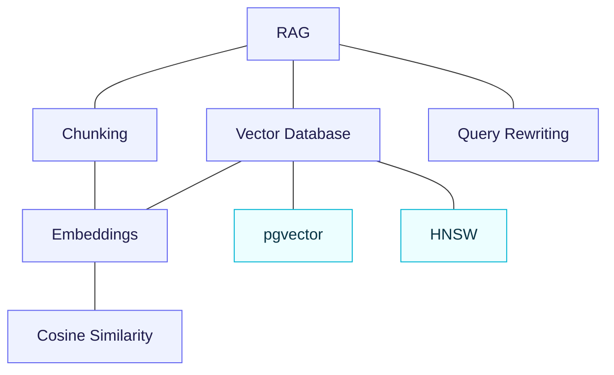
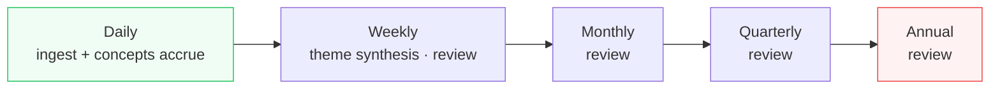

# Lorekeeper

[](https://www.rust-lang.org)
[](LICENSE)
[](https://deepwiki.com/junyeong-ai/lorekeeper)

> **English** | **[한국어](README.md)**

**Turn your scattered daily work into a knowledge wiki that grows itself.**
Lorekeeper collects from Gmail, Slack, Jira, Calendar, RSS, and dropped notes every day, deduplicates them, extracts concepts, and writes structured Obsidian markdown. The LLM does the *bookkeeping*, so your knowledge **compounds** instead of rotting.

---

## Why Lorekeeper?

Notes and wikis fail not because reading or thinking is hard, but because of the **bookkeeping** — updating cross-references, deduping, classifying, flagging contradictions. People can't keep up, so the wiki gets abandoned. Lorekeeper hands that bookkeeping to an LLM.

> 📖 **New to the terms?** — **vault**: a folder of markdown files (i.e. your knowledge store) · **concept**: one page per topic · **link**: a `[Display](relative/path.md)` markdown link between pages (resolves in Obsidian, GitHub, and any OKF consumer) · **bookkeeping**: the chore of updating links, dedup, and categories by hand.

| | |
|---|---|
| 📥 **Configure once → runs daily** | Collects yesterday's activity and knowledge from email, chat, issues, calendar, feeds, and notes |
| 🧹 **Cuts the noise** | Dedup, filters irrelevant items, splits *your* work into a work-log automatically |
| 🧩 **Concepts as assets** | The same concept converges to one page (`Vector DB` = `vector-database`), categorized and related |
| 🔗 **A connected knowledge graph** | Markdown links, backlinks, and clusters connect concepts |
| 📈 **Compounding** | Weekly / monthly / quarterly / annual synthesis — value grows over time |
| 🔑 **No API key** | Claude Code's own session does the LLM work (no separate LLM API integration) |

> 💡 Inspired by Andrej Karpathy's *"LLM-maintained wiki"*: **source material stays distinct from generated knowledge**, **the LLM writes and maintains the wiki**, and **the schema (config) defines the workflow**. You curate sources and ask questions; the LLM does the bookkeeping.

---

## At a glance


```mermaid
flowchart LR
    subgraph SRC["📡 Data sources"]
        direction TB
        G["Gmail"]
        S["Slack"]
        J["Jira"]
        C["Calendar"]
        R["RSS"]
        M["Note inbox"]
    end
    SRC --> L["⚙️ lore (Rust CLI)"]
    L --> P["collect · normalize · dedup<br/>classify · render · graph"]
    P --> V[("🗂️ Obsidian Vault<br/>daily · concepts · documents")]
    L -. "LLM task queue" .-> CC["🤖 Claude Code<br/>/lore-process"]
    CC -. "summaries · concepts · synthesis" .-> V
```

`lore` (the deterministic Rust binary) builds the structure; `/lore-process` (a Claude Code skill) fills the parts that need *judgment* — summaries, concepts. It uses Claude Code's LLM session directly, with no API key.

---

## Quick start

> **Before you start, you'll need** — nothing exotic:
> - 💻 **macOS or Linux** (Windows ships a PowerShell installer)
> - 🤖 **Claude Code** — `/lore-process` fills in summaries & concepts (uses your Claude Code session)
> - 🔑 **Credentials only for the sources you enable** — e.g. Google sign-in for Gmail/Drive/Calendar, a token for Slack
> - 🗂️ **(optional) Obsidian** — for pretty graph browsing. Without it, the output is still plain markdown
>
> 💡 The starter enables **one local note inbox without provider credentials**. Add RSS, work sources or personal tracking when needed. Summaries and concepts require an authenticated Claude Code session.

```bash
# 1) Install — binary + templates + Claude Code skills in one go
curl -fsSL https://raw.githubusercontent.com/junyeong-ai/lorekeeper/main/scripts/install.sh | bash

# 2) First setup — preserve an existing config.yaml and edit it
LORE_CONFIG_DIR="${XDG_CONFIG_HOME:-$HOME/.config}/lorekeeper"
cp -n "$LORE_CONFIG_DIR/config.starter.yaml" "$LORE_CONFIG_DIR/config.yaml"
${EDITOR:-vi} "$LORE_CONFIG_DIR/config.yaml"  # set vault.root, timezone, locale and identity

# 3) Validate locally and generate the knowledge-writing contract
lore validate
lore schema
mkdir -p "$(lore config vault-root)/inbox"
```

Put one note in the vault's `inbox/`, then collect it. `inbox_dir: inbox` follows
your selected `vault.root`. The starter does not need the provider credential wizard.

```bash
# 4) Check input access, then collect for real
lore ingest --dry-run
lore ingest
```

Next, run **`/lore-process`** in Claude Code to publish summaries, concepts and
relationships. Collection alone does not complete knowledge processing. Then verify:

```bash
lore queue check
lore wiki reviews --check
lore wiki search "your note's topic" --json

# 5) Optional automation: generate definitions, then register with the OS
lore schedule --pipeline-dir ~/.local/share/lorekeeper/pipelines > lorekeeper.cron
#    review and merge with crontab -e; on macOS see "Scheduling" below
```

`config.example.yaml` is the full option catalog, with every source disabled.
Copy only the blocks you need into your real `config.yaml`, fill in their scope and
account values, then enable them. `/lore-setup` helps with those choices and ID discovery.
For an authenticated source, run `lore init credentials` and then
`lore ingest --dry-run <source-id>`. Definition generation, OS registration and an
actual run are separate steps; follow [Scheduling](#scheduling).

> You don't need Obsidian — the output is plain markdown + folders, readable as text. Obsidian just makes the graph nicer to browse.

---

## What do you actually get?

Let's walk through a hypothetical. **Sumin**, an AI engineer, drops a RAG troubleshooting note into the vault's `inbox/`.

> The page examples below show **key fields only** — real files also carry housekeeping frontmatter such as `updated`.

### 📝 Input — `inbox/rag-retrieval-quality.md`

```markdown
# RAG pipeline: fixing low-recall retrieval

Problem: ~30% of queries retrieved irrelevant chunks, so the generator hallucinated.
Cause: (1) 2000-token chunks were too coarse — a chunk's embedding averaged several
       topics. (2) We embedded the raw conversational question.
Fix: re-chunk to ~400 tokens, rewrite the question into a standalone query, switch
     similarity L2 → cosine. Recall@5: 0.62 → 0.91.
```

### ▶️ Run

```console
$ lore ingest
▸ notes (manual)
  extracted: 1 items
  ✓ wrote: wiki/documents/rag-pipeline-fixing-low-recall-retrieval.md (document)

Done. 1 pages written, 0 personal items tracked.
```

The page exists, but its `## Summary` / `## Related Concepts` are still empty — `lore ingest` queued the LLM work:

```console
$ lore queue status
  [current] sum-… (summarize)        → wiki/documents/rag-pipeline-…
  [current] ext-… (extract-concepts) → wiki/documents/rag-pipeline-…
queue: 2 current, 0 done, 0 stale, 0 missing-target, 0 unreadable across 2 task(s)
```

Now, in a Claude Code session, run **`/lore-process`**. The skill drains that queue — writing each summary and extracting concepts — using Claude's own LLM (no API key). When it finishes, `lore queue status` reports `0 current` and the page is filled:

### ✅ Result ① — the document page (summary + concept links filled in)

```markdown
---
id: rag-pipeline-fixing-low-recall-retrieval
type: document
title: "RAG pipeline: fixing low-recall retrieval"
created: 2026-06-13
tags: ["document"]
---

## Summary
Re-chunking from 2000→400 tokens, rewriting conversational questions into standalone
queries, and switching similarity from L2 to cosine lifted Recall@5 from 0.62 → 0.91.
This note reports a joint intervention; it does not isolate the effect of each
change or establish a ranking across other environments.

## Content
… (normalized, preserved from the original) …

## Related Concepts
- [Retrieval-Augmented Generation](../../wiki/concepts/retrieval-augmented-generation.md)
- [Vector Database](../../wiki/concepts/vector-database.md)
- [Chunking](../../wiki/concepts/chunking.md)
- [Query Rewriting](../../wiki/concepts/query-rewriting.md)
```

### ✅ Result ② — concept pages **converge** (the key payoff)

Days later Sumin drops another note, *"Choosing a vector database for production."* "Vector database" appears in both notes — but instead of forking a new page, it **joins the existing concept**:

```markdown
---
id: vector-database
type: concept
title: "Vector Database"
aliases: ["Vector Database", "Vector DB"]
category: ai-ml
source_count: 2          # ← two documents cite this one concept
---

## Synthesis
A vector database stores high-dimensional embeddings and serves approximate
nearest-neighbor (ANN) search over them. The second note chose pgvector in an existing
PostgreSQL environment to reduce the cost of operating a separate system. Keep the
conditions of that decision separate from the first note's retrieval-quality observation.

## Sources
- [Choosing a Vector Database for Production](../../wiki/documents/choosing-a-vector-database-for-production.md)
- [RAG Pipeline: Fixing Low-Recall Retrieval](../../wiki/documents/rag-pipeline-fixing-low-recall-retrieval.md)
```

> Whether you write `Vector DB` or `Vector Database`, it lands on **one page** (registered as an alias). Knowledge not fragmenting — that *is* the "compounds over time" promise.

### ✅ Result ③ — disclose detail as needed

```bash
lore wiki prepare                           # create a reusable SQLite snapshot
lore wiki search "Vector DB" --snapshot <id> --limit 10 --json
lore wiki browse --type concept --category ai-ml --limit 20 --json
lore wiki read wiki/concepts/vector-database.md # outline/revision → select a section
lore wiki links wiki/concepts/vector-database.md --limit 20
lore wiki reviews        # inspect unresolved judgments separately
```

Markdown is authoritative; `.lorekeeper/search.sqlite` is a rebuildable navigation layer.
Start with names, aliases, excerpts and source identifiers, then read selected sections,
relationships, evidence and preserved originals. `wiki search --body` supports literal
text and `--regex` searches. Ranking and citation counts are not confidence scores.

A snapshot contains captured content. Prepare again after changes and verify evidence
using the returned revision. Follow `next_offset` for page/link inventories. Snapshot
link pagination keeps the same snapshot; do not combine it with live `--revision`.

The default `index.md` is a small entry guide. Explicitly enabling Markdown exports
also generates `catalog/`, `log.md` and `map.md`, with at most 100 catalog entries
per page. These are optional derived navigation, not duplicate knowledge or evidence.
The log sorts declared creation dates, which are not collection history. `--snapshot` search,
filters and pagination use SQLite; omitting it reads current Markdown; Obsidian still follows the original page links.

A conflict requires incompatible claims under comparable conditions. A newer date
or more citations cannot resolve it automatically. `wiki reviews` exposes current
judgments; evidence changes require reassessment while preserving prior decisions.
Scheduled `queue check` and `wiki reviews --check` detect unfinished work and evidence
drift, not universal semantic truth.

Before reassessment, archive the prior judgment with
`lore wiki evidence --archive <review-path>`. Read and archive new evidence, explicitly
replace `review.evidence`, and record a dated judgment with the prior archive path.
Never update revision labels without reassessing the judgment.

### ✅ Result ④ — a knowledge graph forms

`lore graph cluster` groups concepts; `suggest-links` proposes link candidates ranked by an Adamic-Adar score that down-weights hub co-citations. Semantic relationships require review of source evidence:


```mermaid
graph TD
    RAG["RAG"]:::ai
    VDB["Vector Database"]:::ai
    EMB["Embeddings"]:::ai
    CHK["Chunking"]:::ai
    QR["Query Rewriting"]:::ai
    COS["Cosine Similarity"]:::ai
    PG["pgvector"]:::infra
    HN["HNSW"]:::infra

    RAG --- VDB
    RAG --- CHK
    RAG --- QR
    VDB --- EMB
    VDB --- PG
    VDB --- HN
    EMB --- COS
    CHK --- EMB

    classDef ai fill:#eef2ff,stroke:#6366f1,color:#1e1b4b
    classDef infra fill:#ecfeff,stroke:#06b6d4,color:#083344
```

### 📈 Over time — compounding


```mermaid
flowchart LR
    D["Daily<br/>ingest + concepts accrue"] --> W["Weekly<br/>theme synthesis · review"]
    W --> Mo["Monthly<br/>review"]
    Mo --> Q["Quarterly<br/>review"]
    Q --> Y["Annual<br/>review"]
    style D fill:#f0fdf4,stroke:#22c55e
    style Y fill:#fef2f2,stroke:#ef4444
```

Each day's ingest grows the concept graph; synthesis summarizes it at ever-higher altitudes. Daily → weekly → quarterly → annual each build **on top of** what's already there, never re-deriving it.

---

## Sources

| Type | Use for | Auth |
|---|---|---|
| `gmail` | Email digest (filter by label / sender) | Google OAuth |
| `slack-channel` | Whole channel = team activity (threads, bot filter, watch_users) | Slack token |
| `slack-search` | Keyword-trend search | Slack user token |
| `jira` | Issues you worked on that day (ADF→Markdown) | Jira API |
| `confluence` | Spaces and pages selected by CQL (storage format→Markdown) | Atlassian OAuth or API token |
| `google-calendar` | Schedule + meeting notes (auto-extracted from Drive links) | Google OAuth |
| `google-drive` | Curated docs in a Drive folder | Google OAuth |
| `rss` | Vendor blogs / news → concepts (no auth, multi-feed) | none |
| `nodex` | A project repository's own decision and learning records → concepts (needs `nodex.toml` and nodex `>=0.60,<0.61`; see [binary selection and evidence versions](.claude/skills/lore-setup/references/config.md#nodex-binary-selection)) | none |
| `manual` | Markdown, text, and HTML files dropped in `inbox/` | none |
| `tasks` | Your own finished tasks — what `lore task` closed becomes the day's page | none |

The source key becomes the vault subfolder name. You can define several of the same type (e.g. `team-slack`, `ai-news`). Full reference: [`config.example.yaml`](config.example.yaml).

To add external knowledge, copy the catalog's `ai-news` or `tech-news` block into your actual config and enable it. The selected feeds cover official announcements, model methods, AI implementation, product evaluation and Korean engineering accounts; additional labs, newsletters and aggregators are optional. `fetch_full_text` retrieves articles from short feeds, but access failures retain only the feed text. `focus` guides summaries and concept extraction without filtering raw collection. Current feed listings and query caps guarantee neither complete history nor factual accuracy.

---

## Core ideas

- **Output is plain markdown** — `daily/{source}/` (raw timeline), `wiki/concepts/` (concepts), `wiki/documents/` (documents), `me/` (work-log & reviews), `synthesis/` (weekly themes).
- **Materialized views** — a page has two layers. The **structural layer** (frontmatter, raw items, headings) re-renders every ingest; the **semantic layer** (summary, concepts, synthesis) is LLM-owned and preserved across re-renders. Unchanged input with matching completion markers enqueues zero LLM work (a BLAKE3 hash decides).
- **Inputs and replay** — unchanged input hashes reuse completed LLM results. Refetching can observe remote edits, deletions and different query windows. RSS event logs retain collected entries after they leave the feed; exact-input regeneration requires a retained queue task.
- **Realized-only** — a future date materializes no page (a forecast isn't knowledge yet). It becomes knowledge once the date arrives.
- **Config decides the vault's language** — `vault.locale` (ko | en) is not a label switch but **the language of every sentence Lorekeeper adds**: summaries, weekly themes, concept definitions, explorations. A concept's NAME is the form its own source writes, so a term a source writes in another language keeps its spelling. Source content is never translated.
- **The graph does the bookkeeping** — `backlinks-sync` (re-derive each concept's citations, count and synthesis input, queueing a rewrite when the evidence moves), `lint` (orphans, broken links, duplicate concepts), `merge` (fold duplicate concepts), `cluster` / `suggest-links` (communities and link candidates).

---

## Commands

```bash
lore validate                 # check config (no network)
lore ingest [source]          # ingest (all sources, or a single one)
lore ingest --dry-run         # preview without writing to the vault
lore ingest --date 2026-06-01 # re-materialize a specific day (backfill / repair)
lore synthesis weekly         # weekly synthesis + personal review (monthly/quarterly/annual too)
lore status                   # one line per subsystem (per-source times: lore health)
lore health                   # warn when a source is overdue vs ingest.schedule
lore health --json            # the same verdict as a contract, for a skill rather than an eye
lore schedule                 # print definitions; OS registration is separate
lore brief --date yesterday   # a day's knowledge — what was learned (a line each), what was seen again (names)
lore fetch <url>              # read a link into the inbox, carrying its address
lore wiki search <query>      # the pages a query reaches, and whether they NAME it or merely mention it
lore wiki browse --category ai-ml --type concept --limit 20 --json # Browse metadata; follow next_offset
lore graph --json neighbors wiki/concepts/example.md # Follow incoming/outgoing links, including evidence
lore graph --json neighbors wiki/concepts/example.md --type concept # Browse linked concepts; --type document selects documents
lore wiki prepare             # Capture once; use --snapshot <id> for repeated searches
lore wiki search "exact text" --body --json # Raw evidence lines/context/revision; opt into --regex
lore wiki document-identity plan --source ID --manifest /tmp/identity.json # Verify legacy copy identity migration
lore wiki read wiki/concepts/example.md # Outline → --section ID; pin subsequent reads with --revision
lore wiki original wiki/documents/example.md # Verified manual original/member roster; select with --member
lore wiki original daily/tech-news/2026-10-18.md # RSS collection inventory, authority and revision
lore wiki original daily/tech-news/2026-10-18.md --revision REV --event EVENT_ID --text-offset 0 --text-limit 4096
lore wiki links wiki/concepts/example.md --limit 20 # Inspect link source lines, context and revision
lore wiki provenance wiki/documents/example.md # Follow declared relations by exact repository + document ID
lore wiki concepts            # list concepts
lore resolve <name>           # which concept page owns a name (0 owned / 1 absent / 2 ambiguous)
lore wiki index / log / map   # rebuild by-topic index / by-time timeline / citation-cluster map
lore graph lint               # structural health (orphans, broken links, duplicate concepts, …)
lore graph suggest-links      # concept-relationship candidates (Adamic-Adar)
lore graph cluster            # topic communities (Louvain)
lore graph backlinks-sync     # re-derive each concept's ## Sources, citation count and synthesis input
lore graph merge <from> <into># fold a duplicate concept into the canonical one
lore graph retract-citation <origin.md> <concept.md> --revision <file_revision> --dry-run # Preview a reviewed citation correction
lore graph normalize --fix    # normalize link spelling across the vault
lore graph index-sync --fix   # repair missing/phantom entries in index.md
lore doctor                   # page contracts: text cleanliness, unanswered sections, credentials
lore extract status           # how far each project's knowledge extraction trails its repository
lore maintenance              # prune ingest logs and drained queue files past retention
lore queue status / prune     # LLM task queue status / clear dead tasks
lore queue apply              # validate and publish all staged section/concept results
lore queue check              # JSON completion check: outstanding work, results and mutations
lore wiki reviews --check     # fail on evidence drift or invalid reviews; open reviews pass
lore queue packet --task-id ID # revision-checked evidence (bodies: --include-content)
lore queue regenerate --task-id ID --dry-run # preview retained-input regeneration
lore queue count              # current task count as a bare integer (for scripts)
lore config vault-root        # the vault's absolute path, and nothing else (for scripts)
lore schema                   # generate wiki/AGENTS.md (the page-format schema)
```

By default, `lore wiki refresh` refreshes the SQLite navigation snapshot and a small `index.md` entry guide. Enable automatic full Markdown catalog/log/map exports with `vault.navigation.markdown_exports: true` (default false). Explicit `wiki index/log/map` and `graph index-sync` remain optional export commands. Graph lint does not require export currency in the default mode. Existing files without a generation marker are preserved; collisions fail explicitly. For each retrieval session, prepare once and repeat `wiki browse/search/links --snapshot ID` (links supports `--direction incoming|both`), then verify originals with `wiki read --revision REV`. Refresh prints the prepared ID too.

For date-based discovery, use `lore wiki browse --snapshot ID --sort created --from 2026-01-01 --to 2026-12-31 --json`. `created` may be the original authoring date rather than the ingestion date. Missing or invalid dates retain an explicit status and are excluded by date filters. Date order is newest first, with unknown dates last when no date filter is applied.

For project documents, `source_record.attributes` preserves attributes from the verified public nodex response. Knowledge authored outside the body, such as a routine’s `prompt`, reaches summary and extraction inputs. Imported instructions are source content, not instructions for the current worker.

New RSS ingests retain pre-classification collection text at immutable hash addresses under `.lorekeeper/evidence/rss/`, referenced by daily `source_record.rss_original`. These are adapter-acquired bodies, not provider HTTP/XML bytes. `event_timestamp` is the adapter’s published-or-updated timestamp, separate from unknown acquisition time (`captured_at: null`). `wiki original` returns metadata first; select an exact `event_id` with the returned `revision`, then paginate the title, blank line and body. New captures report `page_bound_collection`; read-only discovery of historical event logs reports `legacy_unbound`, which does not establish that a current daily was derived from those historical bytes. A summary is an interpretation, and omission does not prove absence from the collected text. Refetching a provider URL does not reproduce the collection. New bound RSS extraction may explicitly select event IDs and immutable payload revisions in `concept_evidence`. Only these selected article dependencies avoid resynthesis after unrelated daily edits; legacy pages and unbound links retain page guards. Use `wiki original ORIGIN --evidence-concept CONCEPT` to discover selections, then `--event ID --revision PAYLOAD_REV` to read that historical article even after its current manifest changes. A retained observation does not establish current truth or independent verification. Extraction omission never retracts a selection; `graph retract-citation --event ID --event-revision PAYLOAD_REV` explicitly removes it. `source_count` continues to count originating pages. Failed original publication prevents its page reference; dry-run stores nothing.

Legacy entries without markers are never inferred to be generated. During upgrade, inspect the current `file_revision` with `lore wiki read wiki/index.md` (and log.md/map.md if present), then run `lore wiki refresh --archive-replace wiki/index.md=FULL_FILE_REVISION` in default SQLite mode. Repeat the option for each root to replace. Exact originals, including hand edits, are retained under `.lorekeeper/navigation-archives/`; the command reports an address/hash receipt. Read retained content with `wiki read <archive_path>`. Other paths, changed revisions, source/knowledge types and inbox collisions are refused. Disable automatic Markdown exports for this migration, then re-enable them if desired. This option has no dry-run.

These are the ones you reach for day to day. `lore --help` lists the full surface;
`lore <command> --help` has each command's flags.

---

## Claude Code skills

Skills that pair with the deterministic `lore` binary — the *judgment* parts run on Claude Code's LLM.

Use Claude Code 2.1.246 or later. Each skill declares a qualified name such as
`/lore-process:lore-process`; the short commands below remain available as aliases.
Scheduled runs explicitly load the selected skill from `LORE_SKILL_DIR` and invoke
its qualified name.

Existing concepts may live at addresses such as `wiki/concepts/group/stored.md`.
Resolution and concept inventory return `group/stored` as the `slug`, and later
ingestion retains that address. Retired names remain reserved against duplicates;
normal search and knowledge briefs exclude retired content.

| Skill | What it does |
|---|---|
| `/lore-process` | Drains the LLM queue after ingest — fills summaries, concepts, themes, reviews |
| `/lore-setup` | Builds your config by inspecting your workspace — discovers Slack channel / Jira project / calendar IDs |
| `/lore-wiki` | Evidence-based `query`, source `add`, current-work `capture`, structural/semantic `audit` |
| `/lore-extract` | Batch-extract transferable knowledge from a project repo (scan→run→audit) |
| `/lore-ingest` | Wraps the `lore` CLI (ingest, synthesis, status, schedule) |
| `/lore-day` | Daily agenda, knowledge briefing, reminders and closing the day |

> e.g. `/lore-wiki query "how do I improve RAG retrieval quality?"` → answers by cross-citing the vault's concepts, and files a good answer back as a page under `wiki/explorations/`.

---

## LLM provider modes

`llm.provider` in `config.yaml`:

| Mode | Default | Description |
|---|:---:|---|
| `queue` | ✓ | Queues JSONL tasks under `<vault>/.lorekeeper/queue/`; `/lore-process` drains them with Claude Code's session — **no separate LLM API integration** |
| `noop` | | No LLM work — for development, CI, or template-only runs |

Unattended operation is what `lore-daily.sh` is for. The drain runs as a `claude -p` session, and `-p` mode cannot ask — anything that would prompt is simply denied — so the tools the protocol spells must be named with `--allowedTools`; the script passes that list along with a preamble telling the session nobody is watching. A failing stage never skips the ones after it: one source failing to collect is no reason to leave the other sources' tasks unanswered.

---

## Install · build

```bash
# One-line install (macOS / Linux) — binary, templates, skills, SHA256-verified
curl -fsSL https://raw.githubusercontent.com/junyeong-ai/lorekeeper/main/scripts/install.sh | bash

# Windows (PowerShell)
irm https://raw.githubusercontent.com/junyeong-ai/lorekeeper/main/scripts/install.ps1 | iex

# Build from source
cargo build --release && ./target/release/lore --help
```

Install flags: `--version`, `--install-dir`, `--data-dir`, `--skill {user,project,none}`, `--from-source`, `--force`, `--yes`, `--dry-run` (`--help` lists them all).

The installer deploys `config.starter.yaml` and `config.example.yaml` in the config
directory and preserves your `config.yaml`. Beside them, `data-dir` records the
installation path and `deployed-skills` records deployed skills. These automatic
records support updates and removal; they contain no credentials.

### Tasks

```bash
lore agenda                       # today: what is committed, what woke, what is due
lore task add "review the spec" --state today
lore task add "answer the index question" --link https://acme.slack.com/archives/C123/p1755600000 --label thread
lore task done 7k2p --note "refresh tokens rotate; retrying after a committed rotation kills the grant"
lore task sync                    # record what you changed in Obsidian
```

The board is `<personal>/tasks.md` — ordinary markdown checkboxes under
`Today / Proposed / Next / Waiting / Someday`. Tick one on your phone or drag a line
to another section; the next `lore task sync` or task mutation command records that change.
The heading is its state, and `Proposed` means it has not been accepted yet.

`lore task done` stores the completion and `--note` in the transition log. Ingesting
the configured tasks source over a window containing that completion date creates
that day's daily page; `/lore-process`
handles the queued summary and concept extraction. Full-source ingestion also
updates the work-log, and the scheduled daily pipeline runs ingestion and semantic
processing together. **What you did becomes evidence alongside what you read.**

### Update, status, removal

```bash
lore self status      # is every deployed copy still the one this binary carries (non-zero if not)
lore self update      # replace the binary with a release, then redeploy skills, pipelines, templates, AGENTS.md
lore self deploy      # redeploy only — the repair `self status` reports
lore self uninstall   # remove what was installed; the vault is never touched
```

The skills, pipeline scripts, templates and both config examples are **compiled into the binary**, and deployed copies can drift; `lore self status` checks them, while `lore self deploy` writes the copies. `lore self update` uses the same settlement check as `lore queue check`: pending work, unreadable or unparseable input, staged results and interrupted publication all block replacement. `--force` permits inspectable unfinished work but never bypasses configuration or storage inspection errors. Older releases are refused unless explicitly selected with `--version`.

---

## Credentials

Environment variables or `<vault>/.lorekeeper/credentials.json` (0600). Env vars take precedence over the file.
On macOS and Linux, credential and lock files granting group or other-user permissions
are refused. Restrict manually created or restored files with `chmod 600` before use.
Writes always use `0600`; the setup wizard refuses an unreadable or malformed existing
store rather than initializing it with empty credentials.
For vaults using the same accounts, optional `credentials.file` selects one shared
store; relative paths resolve against the config file. Cooperating processes lock
OAuth refresh and successor persistence together. Do not copy rotating refresh
tokens into independent files; other applications should use their own OAuth app.

```bash
lore init credentials   # interactive wizard — Google tokens minted via browser OAuth
```

- **Google**: `LORE_GOOGLE_CLIENT_ID/SECRET/REFRESH_TOKEN` — Gmail/Drive/Calendar **read-only** scopes. Needs a "Desktop app" OAuth client.
- **Slack**: `LORE_SLACK_TOKEN` (bot `xoxb-`) or `LORE_SLACK_USER_TOKEN` (`xoxp-`). `slack-search` requires the user token.
- **Atlassian** (Jira/Confluence): `LORE_ATLASSIAN_SITE_URL` + `LORE_ATLASSIAN_PAT` (Data Center), or `+ LORE_ATLASSIAN_EMAIL` + `LORE_ATLASSIAN_API_TOKEN` (a Cloud CLASSIC token, addressed at the site). Add `LORE_ATLASSIAN_CLOUD_ID` for a SCOPED token — that value is what selects the gateway route, and without it the token is treated as classic and sent to the site. OAuth is deliberately not env-supplied — its refresh token rotates and must be persisted, so mint it with `lore init credentials`.

> The default credential file is excluded from Git. Keep explicitly selected shared stores out of commits and synchronization too.

---


Identity migration also accepts repeatable `--history-ref <full-commit-id>` on
`lore wiki document-identity plan` to verify historical source copies. The plan seals
Git blobs, authored IDs and exact projected bodies; `check` and `apply` revalidate them.
`apply --allow-blocked` migrates the verified subset and leaves unresolved pages untouched.

To deliberately rewrite one concept from its current citations, preview
`lore graph resynthesize wiki/concepts/example.md --dry-run`, then omit `--dry-run`
and process the queued task. This works after the historical task has expired;
`queue regenerate --task-id` still requires retained original input.

## Scheduling

```bash
lore schedule --pipeline-dir ~/.local/share/lorekeeper/pipelines > lorekeeper.cron   # Linux: review, then merge with crontab -e
lore schedule --format launchd --bin "$(command -v lore)" \
              --pipeline-dir ~/.local/share/lorekeeper/pipelines               # macOS
```

`lore schedule` prints definitions; it does not register them with the OS. On Linux,
review `lorekeeper.cron` and merge it into existing jobs with `crontab -e`. Piping
straight into `crontab -` replaces the entire existing crontab. On macOS, save each
printed plist separately at its named `~/Library/LaunchAgents/` path, create the log
directory, then register it with
`launchctl bootstrap gui/$(id -u) <absolute-plist-path>`. Inspect
`launchctl print gui/$(id -u)/com.lorekeeper.ingest` and an actual execution log.

Changes to schedule times or executable paths require regenerated definitions and
OS registration. For launchd, boot out the existing job before bootstrapping its new
plist, and unload disabled or removed jobs. On Linux, edit only the Lorekeeper
entries. `self uninstall` does not unregister OS jobs. Schedule times use the host's
local timezone, independently of vault date calculations. Wake recovery does not
backfill every missed collection date.

Period timers retain an exact closed period with `--defer`. After collection and
semantic publication, the daily pipeline resumes base periods, quarters and years
in order. Inspect `lore synthesis pending --status --json` for blocked dependencies
and scope limits. An unobserved closing day needs an explicit backfill; retained
pages do not establish complete historical collection. Use launchd `--namespace`
and `--log-dir` to isolate test installations.

Complete onboarding distinguishes config validation, source-access dry runs, first
real ingestion and `/lore-process`, OS registration, and actual scheduled execution.
`validate` does not verify credentials. Authentication in metadata-discovery helper
CLIs does not authenticate Lore's adapters.

Scheduled headless LLM calls run through `lore workflow --wait -- COMMAND...`, holding a separate Unix advisory lease while the skill reads, judges and publishes. The scripts use `/bin/bash`; deterministic collection, period creation, maintenance and reminders retain their short writer locks. Monthly, quarterly and annual reviews retain their calendars and wait for exclusive vault access. Maintenance and queue pruning run sequentially in one job. When replacing an existing schedule, unload and remove the old `com.lorekeeper.queue-prune` LaunchAgent. Template overrides are carried into the scheduled environment.

Start a manual author/review/publish session under the same lease, before reading its inputs:

```bash
lore --config /absolute/config.yaml workflow -- claude
# Explicitly wait rather than refuse a busy workflow:
lore --config /absolute/config.yaml workflow --wait -- claude
```

Manual contention refuses before starting the command unless `--wait` is explicit; scheduled LLM calls wait. Collection and period selection happen before that wait. Do not reacquire inside the session or pipeline: ordinary child `lore` commands keep their short writer locks. The lease follows Unix exec and inherited descriptors, with no PID file or expiry. A program that closes inherited descriptors or detaches work is outside this guarantee; Windows is unsupported. It does not block unwrapped commands or external editors. Existing sessions and running jobs are not adopted automatically: stop and verify old scheduled children have exited, deploy the updated pipeline scripts, then begin guarded work. Never delete the lock file to clear contention.

`ingest.schedule` emits one job that collects **every source in one process**, using `lore-daily.sh` with `--pipeline-dir` and bare `lore ingest` otherwise. A source-filtered ingest skips the cross-source work-log. Each synthesis period (weekly/monthly/quarterly/annual) keeps its own calendar, and `maintenance.schedule` automates retention and queue pruning.

For unattended operation the installer ships `lore-daily.sh` (daily ingest + queue drain + graph reconcile), `lore-weekly.sh` (weekly synthesis + knowledge audit), and separate monthly, quarterly, annual and maintenance entry scripts. A system scheduler (launchd or cron) fires them, so they run whether or not Claude Desktop is open.

`--pipeline-dir` is what actually puts those scripts on the schedule. `lore ingest` and `lore synthesis weekly` are only a pipeline's FIRST stage — the queue drain and `queue apply` live in the scripts — so emitting without it ingests every morning and leaves summaries and concepts empty forever. A scheduler hands a job almost no environment, so the entry also carries the `PATH`, `lore`, `claude` and config path the scripts need, inherited from the session that ran the command rather than guessed. Prefer launchd on macOS: it coalesces missed calendar runs after sleep rather than replaying every missed date. Cron skips runs while asleep.

---

### Versioning the vault with Git (optional)

Keep a backup or a reviewed Git commit before substantial rewrites or merges. Pipelines never stage or commit automatically because they cannot distinguish concurrent user edits from their own output. A mutation journal resumes interrupted changes; it is not a historical backup.

Exclude `.lorekeeper/`, credentials and any private local state from Git. Review `git status` and `git diff`, then stage only the intended files. Generated `index.md`, `catalog/`, `log.md` and `map.md` can be excluded under the configured wiki directory. Check the sharing scope before using a remote repository.

---

## Learn more

- **Full config reference** — [`config.example.yaml`](config.example.yaml) (every source and option, commented)
- **Page-format schema** — `lore schema` generates `wiki/AGENTS.md` in your vault
- **Architecture deep-dive** — [DeepWiki](https://deepwiki.com/junyeong-ai/lorekeeper)

## Built with

Rust 2024 edition · build toolchain 1.99.1 · MSRV 1.97. `tokio`/`reqwest` (async sources), `jiff` (timezone-correct dates), `serde-saphyr` (YAML), `minijinja` (templates), `feed-rs` (feeds), `petgraph` (link graph), `blake3` (event/cache hashing). License: MIT.
