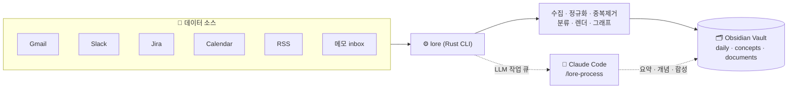
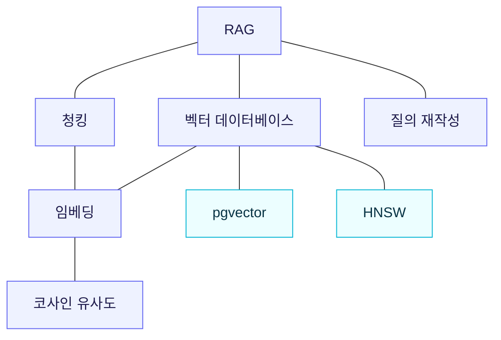
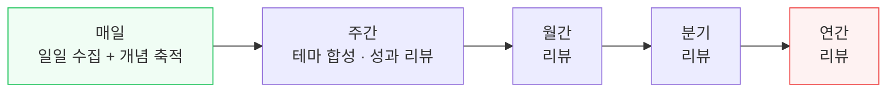

# Lorekeeper

[](https://www.rust-lang.org)
[](LICENSE)
[](https://deepwiki.com/junyeong-ai/lorekeeper)

> **[English](README.en.md)** | **한국어**

**흩어진 일상의 작업을 스스로 자라는 지식 위키로.**
Gmail·Slack·Jira·캘린더·RSS·메모를 매일 모아 중복을 없애고, 개념을 추출하고, Obsidian 마크다운으로 정리합니다. LLM이 *정리·연결·갱신(부기)* 을 대신하니 지식은 방치되지 않고 **복리로 쌓입니다.**

---

## 왜 Lorekeeper인가?

메모·위키가 실패하는 진짜 이유는 *읽기·생각하기*가 아니라 **부기(bookkeeping)** — 교차참조 갱신, 중복 정리, 분류, 모순 점검 — 의 부담입니다. 사람이 이걸 못 버텨서 위키를 방치하죠. Lorekeeper는 그 부기를 LLM에게 맡깁니다.

> 📖 **처음 보는 용어들** — **vault**: 마크다운 파일이 모인 폴더(곧 당신의 지식 저장소) · **개념(concept)**: 한 주제당 한 페이지 · **링크**: 페이지를 잇는 `[표시 이름](상대/경로.md)` 마크다운 링크(Obsidian·GitHub·OKF 어디서든 해석) · **부기**: 링크·중복·분류를 손으로 갱신하는 그 잡일.

| | |
|---|---|
| 📥 **설정 한 번 → 매일 자동** | 메일·메신저·이슈·일정·피드·메모에서 어제의 활동·지식을 수집 |
| 🧹 **노이즈 제거** | 중복 차단, 관련 없는 항목 필터, 내 일은 work-log로 자동 분리 |
| 🧩 **개념 자산화** | 같은 개념은 한 페이지로 수렴(`Vector DB` = `vector-database`), 카테고리·연관관계 정리 |
| 🔗 **연결되는 지식 그래프** | 마크다운 링크·역링크·클러스터로 개념이 서로 이어짐 |
| ✅ **할 일 → 기록** | `lore task`로 관리한 할 일이 완료되는 순간 그날의 페이지가 됨 — SaaS에 흔적을 남기지 않은 일도 work-log와 성과 리뷰에 잡힘 |
| 📈 **복리** | 주간·월간·분기·연간 합성으로 시간이 갈수록 가치↑ |
| 🔑 **API 키 불필요** | Claude Code 세션이 직접 LLM 작업 수행 (별도 과금 없음) |

> 💡 영감: Andrej Karpathy의 *"LLM이 관리하는 위키"* — **원본은 불변**, **위키는 LLM이 작성·유지**, **스키마(config)가 워크플로를 정의**. 사람은 소스를 고르고 질문하고, LLM은 부기를 한다.

---

## 한눈에 보기



`lore`(결정론적 Rust 바이너리)가 구조를 만들고, `/lore-process`(Claude Code 스킬)가 요약·개념 같은 *판단이 필요한 부분*을 채웁니다. API 키 없이 Claude Code의 LLM 세션을 그대로 씁니다.

---

## 빠른 시작 (5분)

> **시작하기 전에 준비물** — 어렵지 않습니다:
> - 💻 **macOS 또는 Linux** (Windows는 PowerShell 설치 스크립트 제공)
> - 🤖 **Claude Code** — `/lore-process`가 요약·개념을 채워줍니다 (별도 API 키·과금 없음)
> - 🔑 **쓰려는 소스의 자격증명만** — 예: Gmail/Drive/Calendar는 Google 로그인, Slack은 토큰
> - 🗂️ **(선택) Obsidian** — 그래프를 예쁘게 탐색용. 없어도 결과물은 평범한 마크다운입니다
>
> 💡 **키 없이 먼저 체험**하고 싶다면 `rss`와 메모 `inbox/`만 켜세요 — 인증이 필요 없어 바로 돌아갑니다.

```bash
# 1) 설치 — 바이너리 + 템플릿 + Claude Code 스킬을 한 번에
curl -fsSL https://raw.githubusercontent.com/junyeong-ai/lorekeeper/main/scripts/install.sh | bash

# 2) 설정 — 예시를 복사해 내 환경에 맞게 편집
cp ~/.config/lorekeeper/config.example.yaml ~/.config/lorekeeper/config.yaml
$EDITOR ~/.config/lorekeeper/config.yaml
#    (어떤 값을 넣어야 할지 모르겠다면 Claude Code에서 `/lore-setup` — 채널/프로젝트 ID를 직접 찾아줍니다)

# 3) 자격증명 — 대화형 마법사 (Google 토큰은 브라우저로 자동 발급)
lore init credentials

# 4) 검증 — 네트워크 없이 설정만 점검
lore validate

# 5) 수집 → 채우기
lore ingest                       # 소스 수집 + 구조 페이지 작성 + LLM 작업 큐잉
#    이어서 Claude Code에서:  /lore-process     ← 요약·개념을 채움

# 6) 매일 자동으로
lore schedule | crontab -         # config의 cron을 crontab으로
```

> Obsidian이 없어도 됩니다 — 결과물은 평범한 마크다운 + 폴더라 그냥 텍스트로 읽힙니다. Obsidian은 그래프 탐색을 예쁘게 보여줄 뿐.

---

## 실제로 어떤 결과가 나오나요?

가상의 시나리오로 따라가 봅니다. AI 엔지니어 **수민**이 RAG 트러블슈팅을 정리한 메모를 vault의 `inbox/`에 떨어뜨립니다.

> 아래 페이지 예시는 **핵심 필드만 발췌**했습니다 — 실제 파일에는 `updated` 같은 관리용 frontmatter도 함께 들어갑니다.

### 📝 입력 — `inbox/rag-검색-품질.md`

```markdown
# RAG 파이프라인: 낮은 recall 검색 고치기

문제: 질의의 30%가 무관한 청크를 검색해 생성기가 환각을 일으켰다.
원인: (1) 청크가 2000토큰으로 너무 커서 임베딩이 여러 주제의 평균이 됨.
      (2) 대화형 질문("그 다른 거는?")을 그대로 임베딩.
해결: 청크를 ~400토큰으로 줄이고, 질문을 standalone 쿼리로 rewrite하고,
      유사도를 L2→cosine으로 변경. Recall@5: 0.62 → 0.91.
```

### ▶️ 실행

```console
$ lore ingest
▸ notes (manual)
  extracted: 1 items
  ✓ wrote: wiki/documents/rag-파이프라인-낮은-recall-검색-고치기.md (document)

Done. 1 pages written, 0 personal items tracked.
```

이 시점에 페이지는 만들어졌지만 `## 요약`·`## 관련 개념`은 비어 있습니다 — `lore ingest`가 LLM 작업을 큐에 넣었기 때문입니다:

```console
$ lore queue status
  [current] sum-… (summarize)        → wiki/documents/rag-파이프라인-…
  [current] ext-… (extract-concepts) → wiki/documents/rag-파이프라인-…
queue: 2 current, 0 done, 0 stale, 0 missing-target, 0 unreadable across 2 task(s)
```

이제 Claude Code 세션에서 **`/lore-process`** 를 실행합니다. 이 스킬이 큐를 비우며 — 각 요약을 쓰고 개념을 추출해 — Claude 자체 LLM으로 처리합니다(API 키 없음). 끝나면 `lore queue status`는 `0 current`가 되고 페이지가 채워집니다:

### ✅ 결과 ① — 문서 페이지 (요약 + 개념 링크가 채워짐)

```markdown
---
id: rag-파이프라인-낮은-recall-검색-고치기
type: document
title: "RAG 파이프라인: 낮은 recall 검색 고치기"
created: 2026-06-13
tags: ["document"]
---

## 요약
청크를 2000→400 토큰으로 줄이고, 대화형 질문을 standalone 쿼리로 재작성하고,
유사도를 L2→cosine으로 바꿔 Recall@5를 0.62 → 0.91로 끌어올렸다. 핵심 교훈:
검색 품질은 임베딩 모델 선택보다 **청크 단위와 질문 형식**에 좌우된다.

## 내용
… (원본을 정규화해 보존) …

## 관련 개념
- [Retrieval-Augmented Generation](../../wiki/concepts/retrieval-augmented-generation.md)
- [벡터 데이터베이스](../../wiki/concepts/벡터-데이터베이스.md)
- [청킹](../../wiki/concepts/청킹.md)
- [질의 재작성](../../wiki/concepts/질의-재작성.md)
```

### ✅ 결과 ② — 개념 페이지가 **수렴**합니다 (핵심 가치)

며칠 뒤 수민이 *"프로덕션 벡터 DB 선택"* 메모를 또 드롭합니다. "벡터 데이터베이스"는 두 메모 모두에 등장하지만 — **새 페이지를 만들지 않고 기존 개념에 합류**합니다:

```markdown
---
id: vector-database
type: concept
title: "벡터 데이터베이스"
aliases: ["벡터 데이터베이스", "Vector DB"]
category: ai-ml
source_count: 2          # ← 두 문서가 이 한 개념을 인용
---

## 핵심
벡터 데이터베이스는 고차원 임베딩을 저장하고 근사 최근접 탐색(ANN)을 제공한다.
선택은 쿼리 지연시간보다 **운영 단순성**에 좌우되는 경우가 많다 — 관계형 데이터
옆에 벡터를 두면(pgvector) 별도 stateful 시스템을 피할 수 있다.

## 출처
- [프로덕션 벡터 DB 선택](../../wiki/documents/프로덕션-벡터-db-선택.md)
- [RAG 파이프라인 낮은 recall 검색 고치기](../../wiki/documents/rag-파이프라인-낮은-recall-검색-고치기.md)
```

> `Vector DB`라고 쓰든 `벡터 데이터베이스`라고 쓰든 **한 페이지**로 모입니다(alias로 등록). 같은 지식이 흩어지지 않는 것 — 이게 "복리로 쌓인다"의 핵심입니다.

### ✅ 결과 ③ — 주제별 인덱스 (`wiki/index.md`)

```markdown
# 위키 인덱스

## 개념 (16)

### ai-ml (6)
- [벡터 데이터베이스](concepts/vector-database.md) — 고차원 임베딩을 저장하고 ANN 탐색을 제공. 선택은 쿼리 지연보다 운영 단순성에 좌우…
- [RAG](concepts/retrieval-augmented-generation.md) — 외부 코퍼스 검색 문맥에 LM 출력을 grounding. 답 품질은 임베딩 모델보다 검색 단계가 지배…
- [청킹](concepts/chunking.md) — 문서를 임베딩·검색 단위로 쪼개는 것. 입도가 검색 품질을 크게 좌우…

### infrastructure (10)
- [Kubernetes](concepts/kubernetes.md) — 컨테이너 오케스트레이션. 안정 운영은 pod 메모리·재시작 지표 관찰에 달림…
```

### ✅ 결과 ④ — 지식 그래프가 형성됩니다

`lore graph suggest-links`·`cluster`가 개념 사이의 관계를 발견합니다(공동인용을 차수로 정규화한 Adamic-Adar 점수):



### 📈 시간이 지나면 — 복리



매일의 수집이 개념 그래프를 키우고, 합성이 그것을 점점 높은 고도에서 요약합니다. 일일 → 주간 → 분기 → 연간으로 갈수록 **이미 쌓인 것을 다시 쓰지 않고** 그 위에 누적됩니다.

---

## 소스

| 타입 | 용도 | 인증 |
|---|---|---|
| `gmail` | 메일 다이제스트 (라벨/발신자로 필터) | Google OAuth |
| `slack-channel` | 채널 전체 = 팀 활동 (스레드·봇필터·watch_users) | Slack 토큰 |
| `slack-search` | 키워드 트렌드 검색 | Slack user 토큰 |
| `jira` | 그날 작업한 이슈 스냅샷 (ADF→Markdown) | Jira API |
| `confluence` | CQL로 고른 스페이스·페이지 (스토리지 포맷→Markdown) | Atlassian OAuth 또는 API 토큰 |
| `google-calendar` | 일정 + 회의록(Drive 링크 자동 추출) | Google OAuth |
| `google-drive` | Drive 폴더의 큐레이션 문서 | Google OAuth |
| `rss` | 벤더 블로그·뉴스 → 개념 (인증 불필요, 다중 피드) | 없음 |
| `manual` | `inbox/`에 드롭한 마크다운·텍스트·HTML 파일 | 없음 |
| `tasks` | 내가 끝낸 작업 — `lore task`로 닫은 항목이 그날의 페이지가 됨 | 없음 |

소스 키 = vault의 하위 폴더 이름. 같은 타입을 여러 개 정의할 수 있습니다(예: `team-slack`, `ai-news`). 전체 예시는 [`config.example.yaml`](config.example.yaml).

---

## 핵심 개념

- **결과물은 평범한 마크다운** — `daily/{소스}/`(원본 타임라인), `wiki/concepts/`(개념), `wiki/documents/`(문서), `me/`(work-log·성과리뷰), `synthesis/`(주간 테마).
- **자료화된 뷰(materialized view)** — 페이지는 두 층. **구조 층**(frontmatter·원본·헤딩)은 매 수집마다 재생성, **의미 층**(요약·개념·합성)은 LLM 소유이며 재렌더에도 보존됩니다. 입력이 안 바뀌면 LLM 작업 0건(BLAKE3 해시로 판정).
- **무손실** — 재실행은 멱등(byte-identical). 스트리밍 소스(RSS)는 영구 이벤트 로그로 스크롤아웃된 항목도 보존.
- **현재만 실체화** — 미래 날짜는 페이지를 만들지 않음(forecast는 지식이 아님). 날짜가 오면 지식이 됩니다.
- **그래프가 부기를 한다** — `backlinks-sync`(개념의 인용·카운트·요약 입력 재도출, 근거가 바뀐 요약은 큐로), `lint`(고아·깨진링크·중복개념), `merge`(중복 개념 통합), `cluster`/`suggest-links`(관계 발견).

---

## 명령어

```bash
lore validate                 # config 점검 (네트워크 없음)
lore ingest [소스]            # 수집 (전체 또는 단일 소스)
lore ingest --dry-run         # vault 변경 없이 미리보기
lore ingest --date 2026-06-01 # 특정 날짜 재실체화(백필/복구)
lore synthesis weekly         # 주간 합성 + 개인 리뷰 (monthly/quarterly/annual)
lore status                   # 하위시스템별 한 줄 요약 (소스별 시각은 lore health)
lore health                   # 수집이 밀린 소스 경고 (ingest.schedule 기준)
lore schedule | crontab -     # cron 발행
lore wiki concepts            # 개념 목록
lore resolve <name>           # 어떤 개념 페이지가 그 이름을 갖는지 (0 소유 / 1 없음 / 2 중복)
lore wiki index / log / map   # 주제별 인덱스 / 시간순 타임라인 / 인용 클러스터 맵 재생성
lore graph lint               # 구조 건강검진(고아·깨진링크·중복개념·…)
lore graph suggest-links      # 개념 간 관계 후보(Adamic-Adar)
lore graph cluster            # 토픽 커뮤니티(Louvain)
lore graph backlinks-sync     # 개념의 ## Sources·인용수·요약 입력 재도출(변한 요약은 큐로)
lore graph merge <from> <into># 중복 개념 통합
lore graph normalize --fix    # 링크 표기 정규화
lore graph index-sync --fix   # index.md 누락/유령 항목 정정
lore doctor                   # 페이지 계약 감사(텍스트 청결도·미답변 섹션·자격증명)
lore maintenance              # 보관기한 지난 ingest 로그·드레인된 큐 파일 정리
lore queue status / prune     # LLM 작업 큐 상태 / 죽은 작업 정리
lore queue apply              # 드레인이 낸 개념 추출을 페이지로 실체화
lore queue count              # current 작업 수만 정수로 출력(스크립트용)
lore config vault-root        # vault 절대경로만 출력(스크립트용)
lore schema                   # wiki/AGENTS.md(페이지 포맷 스키마) 생성
```

일상적으로 쓰는 것들만 추렸다. 전체 목록은 `lore --help`, 각 명령의 플래그는
`lore <명령> --help`.

---

## Claude Code 스킬

`lore` 바이너리(결정론)와 짝을 이루는 스킬 — *판단이 필요한* 부분을 Claude Code의 LLM이 담당합니다.

| 스킬 | 하는 일 |
|---|---|
| `/lore-process` | 수집 후 LLM 큐를 비움 — 요약·개념·테마·리뷰 채우기 |
| `/lore-setup` | 워크스페이스를 들여다보며 config 작성 — Slack 채널·Jira 프로젝트·캘린더 ID 자동 발견 |
| `/lore-wiki` | 시맨틱 질의(compounding) · 소스 추가 · 구조/의미 감사 |
| `/lore-capture` | 작업 중 떠오른 인사이트를 즉시 vault에 포착 |
| `/lore-extract` | 프로젝트 repo의 전이가능한 지식을 일괄 추출 (scan→run→audit) |
| `/lore-ingest` | `lore` CLI 래퍼 (수집·합성·상태·스케줄) |

> 예: `/lore-wiki query "RAG 검색 품질을 어떻게 올리지?"` → vault의 개념들을 교차 인용해 답하고, 좋은 답은 `wiki/explorations/`에 페이지로 환류합니다.

---

## LLM 제공자 모드

`config.yaml`의 `llm.provider`:

| 모드 | 기본 | 설명 |
|---|:---:|---|
| `queue` | ✓ | `<vault>/.lorekeeper/queue/`에 JSONL 작업을 쌓고, `/lore-process`가 Claude Code 세션으로 처리 — **API 키·별도 과금 없음** |
| `noop` | | LLM 작업 없음 — 개발·CI·템플릿만 필요할 때 |

무인 cron: `lore ingest; claude -p "/lore-process"` (`&&`가 아닌 `;` — 일부 소스 실패해도 정상 소스의 큐는 처리되도록).

---

## 설치 · 빌드

```bash
# 원라인 설치 (macOS / Linux) — 바이너리·템플릿·스킬, SHA256 검증 포함
curl -fsSL https://raw.githubusercontent.com/junyeong-ai/lorekeeper/main/scripts/install.sh | bash

# Windows (PowerShell)
irm https://raw.githubusercontent.com/junyeong-ai/lorekeeper/main/scripts/install.ps1 | iex

# 소스에서 빌드
cargo build --release && ./target/release/lore --help
```

설치 플래그: `--version`, `--install-dir`, `--data-dir`, `--skill {user,project,none}`, `--from-source`, `--force`, `--yes`, `--dry-run` (`--help`로 전체 확인).

### 할 일 관리

```bash
lore agenda                       # 오늘 할 일 — 커밋된 것, 깨어난 것, 기한이 온 것
lore task add "스펙 리뷰" --state today
lore task add "인덱스 질문 회신" --link https://acme.slack.com/archives/C123/p1755600000 --label 스레드
lore task done 7k2p --note "refresh token은 회전 후 재시도하면 grant가 무효화된다"
lore task sync                    # Obsidian에서 직접 고친 것을 기록에 반영
```

보드는 `<personal>/tasks.md` — `오늘 / 다음 / 대기 / 언젠가` 네 섹션의 평범한 마크다운 체크박스입니다. 폰의 Obsidian에서 체크하거나 줄을 다른 섹션으로 끌어 옮겨도 그대로 상태 변경으로 인정됩니다(섹션 제목이 곧 상태). 완료한 할 일은 그날의 데일리 페이지가 되고, `--note`로 남긴 내용은 개념 추출까지 흘러갑니다 — **읽은 것뿐 아니라 한 일도 복리로 쌓입니다.**

### 업데이트 · 상태 · 제거

```bash
lore self status      # 배포된 사본이 지금 바이너리와 같은지 (다르면 non-zero)
lore self update      # 새 릴리스로 교체하고, 스킬·파이프라인·템플릿·AGENTS.md 재배포
lore self deploy      # 재배포만 (self status가 보고한 차이를 고침)
lore self uninstall   # 설치한 것만 제거 — vault는 건드리지 않음
```

스킬·파이프라인·템플릿·`config.example.yaml`은 **바이너리에 내장**되어 있습니다. 별도로 내려받는 아티팩트가 없으니 버전이 어긋날 수 없고, `lore self deploy`가 사본을 씁니다. `lore self update`는 큐에 처리 대기 중인 작업이 있으면 거부하고, 실행 중인 버전보다 오래된 릴리스도 거부합니다(`--version`으로 명시하면 되돌릴 수 있음).

---

## 자격증명

환경변수 또는 `<vault>/.lorekeeper/credentials.json`(0600). 환경변수가 파일보다 우선.

```bash
lore init credentials   # 대화형 마법사 — Google 토큰은 브라우저 OAuth로 자동 발급
```

- **Google**: `LORE_GOOGLE_CLIENT_ID/SECRET/REFRESH_TOKEN` — Gmail/Drive/Calendar **읽기 전용** 스코프. "Desktop app" OAuth 클라이언트 필요.
- **Slack**: `LORE_SLACK_TOKEN`(bot `xoxb-`) 또는 `LORE_SLACK_USER_TOKEN`(`xoxp-`). `slack-search`는 user 토큰 필수.
- **Atlassian** (Jira/Confluence): `LORE_ATLASSIAN_SITE_URL` + `LORE_ATLASSIAN_PAT` (Data Center), or `+ LORE_ATLASSIAN_EMAIL` + `LORE_ATLASSIAN_API_TOKEN` (Cloud). OAuth은 리프레시 토큰이 회전하므로 환경변수로 받지 않습니다 — `lore init credentials`로 발급하세요.

> 자격증명은 `credentials.json`(gitignored)에만 — repo에 절대 커밋되지 않습니다.

---

## 스케줄링

```bash
lore schedule --pipeline-dir ~/.local/share/lorekeeper/pipelines | crontab -   # Linux
lore schedule --format launchd --bin "$(command -v lore)" \
              --pipeline-dir ~/.local/share/lorekeeper/pipelines               # macOS
```

`ingest.schedule`은 **전체 소스를 한 번에** 도는 `lore ingest` 한 줄을 발행합니다(work-log가 cross-source 일일 집계라 소스별 분할 실행은 페이지를 부분 덮어씀). 각 합성 주기(weekly/monthly/quarterly/annual)는 자기 cron을 발행하고, `maintenance.schedule`이 있으면 청소 작업도 자동화됩니다.

무인 운영용으로 두 개의 파이프라인 스크립트(`lore-daily.sh`, `lore-weekly.sh`)가 함께 설치됩니다 — 일일 수집+큐 처리+그래프 정합, 주간 합성+지식 감사. 시스템 스케줄러(launchd/cron)가 이를 실행하므로 Claude 데스크탑이 떠 있지 않아도 동작합니다.

`--pipeline-dir`가 그 스크립트를 **실제로 스케줄에 태우는** 플래그입니다. `lore ingest`와 `lore synthesis weekly`는 파이프라인의 첫 단계일 뿐이고 큐 드레인과 `queue apply`는 스크립트에만 있으므로, 이 플래그 없이 발행하면 매일 수집만 하고 요약·개념은 영원히 비어 있게 됩니다. 스케줄러는 환경을 거의 물려주지 않으므로 스크립트가 필요로 하는 `PATH`/`lore`/`claude`/config 경로도 함께 실립니다 — 추측이 아니라 이 명령을 실행한 세션에서 그대로 상속합니다. macOS는 launchd를 권합니다: 잠든 사이 놓친 작업을 깨어나면 실행하지만 cron은 조용히 건너뜁니다.

---

## 더 알아보기

- **설정 전체 레퍼런스** — [`config.example.yaml`](config.example.yaml) (모든 소스·옵션 주석 포함)
- **페이지 포맷 스키마** — `lore schema`로 vault에 `wiki/AGENTS.md` 생성
- **아키텍처 깊이 보기** — [DeepWiki](https://deepwiki.com/junyeong-ai/lorekeeper)

## 기술 스택

Rust 1.97 · 2024 edition. `tokio`/`reqwest`(비동기 소스), `jiff`(타임존 정확 날짜), `minijinja`(템플릿), `petgraph`(링크 그래프), `blake3`(이벤트·캐시 해시). 라이선스: MIT.
